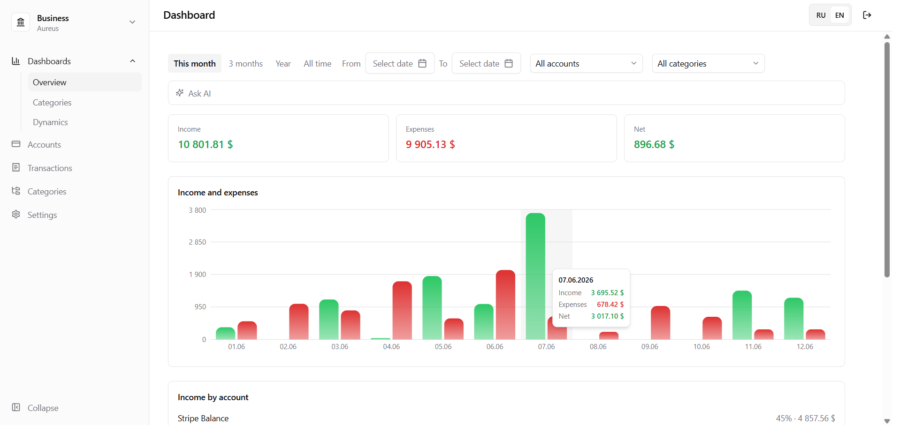
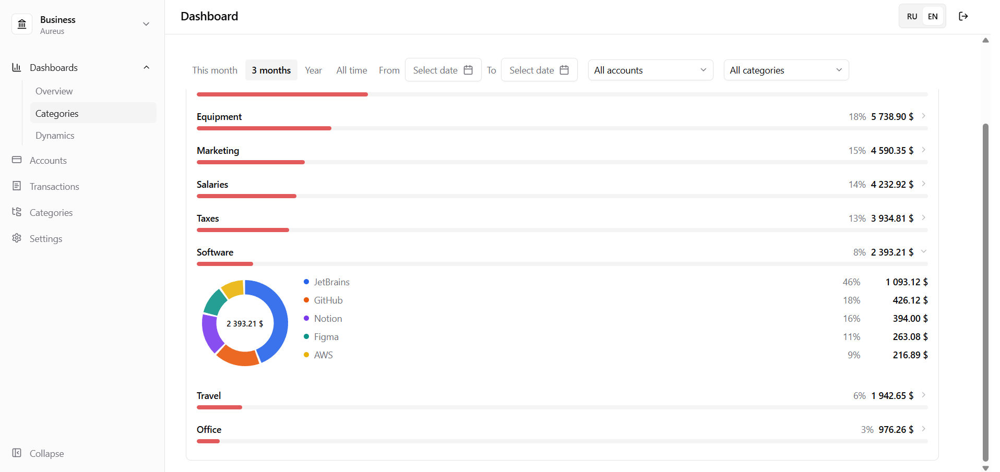
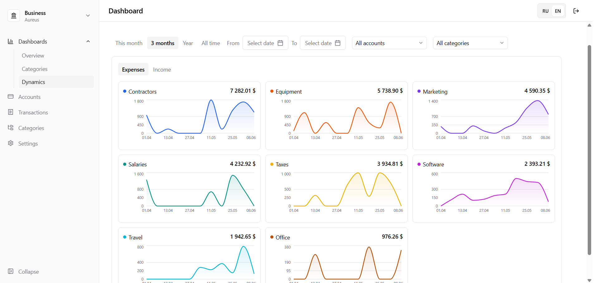
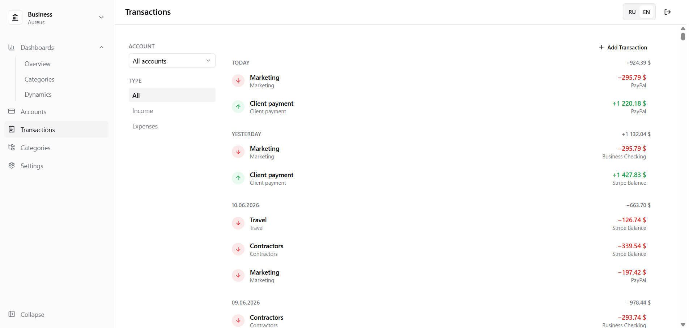
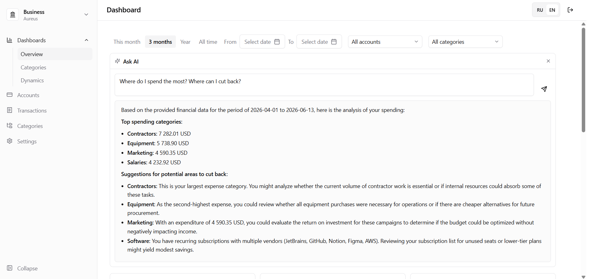

# Aureus

[English](#english) · [Русский](#русский)

[Tech Stack](#tech-stack) · [Getting started](#getting-started)

---

<details>
<summary><b>📸 Screenshots</b></summary>

<br>











</details>

---

<a name="english"></a>

## English

Personal finance service. Track income and expenses across accounts and categories, organized by workspaces.

### What's done

- **Auth** — registration with email verification (3-step: email → OTP code → password) and login with JWT
- **Workspaces** — independent spaces for different finances: personal, work, family, and more
- **Financial accounts** — multi-currency accounts with running balance
- **Categories** — income and expense categories
- **Transactions** — list grouped by date with daily net; filter by account and type
- **Dashboard analytics** — three-tab view navigated from the sidebar; filter by period, accounts, and categories; per-currency view throughout
  - **Overview** — income/expense/net summary cards, income-vs-expense bar chart, breakdowns by account
  - **Categories** — accordion list with progress bars; expanding a category loads a name-level breakdown rendered as an interactive donut chart
  - **Dynamics** — per-category small-multiples area charts showing spend over time
- **Ask AI** — collapsible panel on the dashboard; ask any question about the period in natural language, powered by gemini-3.1-flash-lite; context strategy adapts to transaction volume (full list / category×period matrix / aggregated timeseries)

### What's next

- **Budgets** — per-category monthly limits with progress tracking
- **Export** — transactions to CSV, reports to PDF
- **CSV import** — bulk transaction import with duplicate detection and pre-import preview
- **Expense forecasting** — 30-day forecast based on time series

---

<a name="русский"></a>

## Русский

Сервис учёта финансов. Учёт доходов и расходов по счетам и категориям, организованный по рабочим областям.

### Что сделано

- **Авторизация** — регистрация с подтверждением email (3 шага: email → OTP-код → пароль) и вход по JWT
- **Рабочие области** — возможность создавать независимые пространства под разные финансы: личные, рабочие, семейные и другие
- **Счета** — мультивалютные счета с актуальным балансом
- **Категории** — категории доходов и расходов
- **Транзакции** — список, сгруппированный по датам с дневным нетто; фильтры по счёту и типу
- **Аналитический дашборд** — три вкладки с навигацией через сайдбар; фильтры по периоду, счетам и категориям; мультивалютный вид
  - **Обзор** — карточки сводки доходов/расходов/нетто, бар-чарт доходов и расходов, разбивки по счетам
  - **Категории** — аккордеон с прогресс-барами; при открытии категории загружается разбивка по названиям транзакций в виде интерактивной donut-диаграммы
  - **Динамика** — мини-графики по каждой категории (small multiples), показывают изменение расходов во времени
- **Спросить ИИ** — коллапсируемая панель на дашборде; задать вопрос о финансах на естественном языке, работает на gemini-3.1-flash-lite; стратегия контекста адаптируется к объёму транзакций (полный список / матрица категория × период / агрегированный таймсериес)

### Что дальше

- **Бюджеты** — лимиты по категориям на месяц, отслеживание прогресса
- **Экспорт** — транзакции в CSV, отчёты в PDF
- **CSV-импорт** — массовая загрузка транзакций с определением дубликатов и предпросмотром
- **Прогнозирование** — прогноз расходов на 30 дней вперёд на основе временных рядов

---

## Tech Stack

**Backend** — .NET 8 (C#), Entity Framework Core, PostgreSQL. Auth via JWT. LLM via Gemini API.

**Frontend** — React + TypeScript (Vite), TanStack Query, Tailwind CSS, react-i18next, Recharts (charts). UI in Russian and English.

**Tests** — unit tests with xUnit + Moq; integration tests with xUnit + Testcontainers.

## Getting started

```bash
# Start the database
docker compose up -d

# Run the API
cd backend/src/Aureus.Api
dotnet run

# Run the frontend
cd frontend
npm install
npm run dev
```
